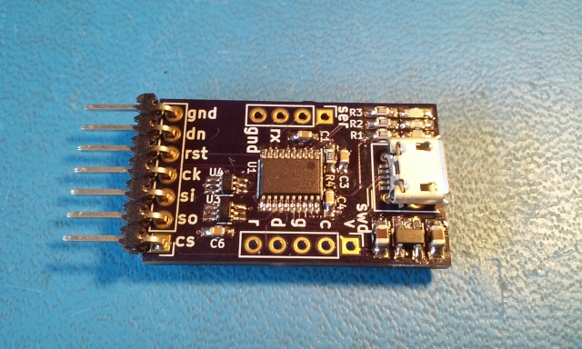

# spi_fiend
STM32F042-based USB to SPI device for programming iCE40 FPGAs

Most open-source projects that use Lattice iCE40 FPGAs rely on the FTDI
FT2232 High-speed UART/FIFO chip to provide a SPI interface for programming
the FPGA and SPI Flash chip which contains the bitstream for self-configuration
at power-up. I've got nothing against FTDI, but the chips are big, require
a crystal and are fairly expensive in DIY quantities. On top of that I've been
using STM32 for years and have been looking for an excuse to dig into some
more USB applications so a USB to SPI bridge seemed like a good place to start.

This device uses the small and inexpensive STM32F042F6P6 in a 20-pin TSSOP
package. It supports crystal-less USB operation by syncing its internal RC
oscillator to the USB SOF signal and has enough SRAM and Flash to support a
moderately complex feature set:

* USB powered
* Crystal-less operation
* Presents an ordinary ACM / CDC class device that looks like a serial port.
* Supports direct loading into the iCE40 SRAM for quick development cycles.
* Supports read/write/erase of standard SPI Flash devices used for FPGA configuration.
* Includes automatic swapping of MOSI/MISO when switching between FPGA and SPI Flash.
* MCU Serial port is pinned out for debugging and future expansion.

## prerequisites
To build this you will need the following tools:

* Kicad - schematic & PCB editor.
* GCC ARM Embedded - cross-compiler for ARM Cortex M: https://developer.arm.com/tools-and-software/open-source-software/developer-tools/gnu-toolchain/gnu-rm
* dfu-util - USB DFU driver application available in most distributions.
* Basic Linux user C compiler (for host application)

## Building Hardware

The board design is available in the 'hardware' directory. The Kicad PCB can
be submitted directly to OSHpark.com, or traditional Gerbers can be exported
using the application. Part values and packages are noted in the schematic.

Note: in the Revision 1 PCB layout the USB connector doesn't overhang the PCB
edge and there is a slight interference with the lower lip. Filing a slight
chamfer on the PCB edge under the connector will allow it to sit flush to the
board.

## Building Firmware

Change to the 'firmware' directory and run 'make' to build the binary file.
Once that builds without error, connect the hardware and push the 'boot'
button, then push and release the 'rst' button to enter the manufacturer's
USB DFU bootloader. Run 'make dfu' to load the firmware into the MCU and then
hit the 'rst' button again to execute the new firmware.

## Building Host Application

The host appliction runs on a Linux PC and communicates with the hardware
device via standard USB Serial protocols. Build the host application by changing
to the 'host' directory and executing 'make'. The built-in help should provide
a guide to available options, but here's a quick list of common actions:

* load a binary into the FPGA: ./cdc_prog BINARY_FILE
* load a binary into SPI Flash: ./cdc_prog -a ADDRESS -w BINARY_FILE
* read SPI flash contents to a file: ./cdc_prog -a ADDRESS -l LENGTH -r > OUTPUT_FILE
* erase SPI FLASH block: ./cdc_prog -a ADDRESS -e
* read SPI Flash ID: ./cdc_prog -i

In ordinary operation, the LED nearest the USB connector lights to indicate powerup,
the center LED lights when an error is detected during operation and the outer LED
lights when programming SPI flash.

